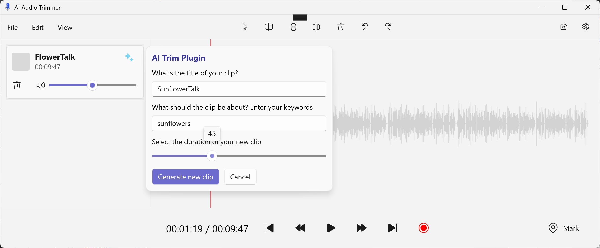

# Local AI on Windows: Explaining the Audio Editor App Sample

Building Windows apps that leverage on-device AI models can seem like a daunting task - there's a lot of work that goes into defining your use case, choosing and tuning the right models, and refining the logic surrounding the models.

While there's no quick and easy path to learning the ins and outs of AI on Windows, we are going to breakdown an application sample that was showcased at Build to help you see how on-device models can be leveraged to power up your applications.

The sample we will be taking a look at is an AI-empowered Audio Editor, built with WinUI3 and WinAppSDK. The application functionality itself is pretty minimal, but provides a good framework to showcase the AI portion of the app.

**Note:** If you want to skip the text and go straight to getting your hands on sample itself, head over to the [project repository](https://github.com/microsoft/Windows-DevRel/tree/main/Samples/AudioEditor) for instructions on running the project.

## What does the sample do with AI?

The Audio Editor app uses several models to enable "smart trimming" of audio, which has a flow like this:

1. User uploads an audio file that includes recognizable speech
2. They provide a theme keyword or phrase and a trim duration
3. The Audio Editor generates a trimmed audio clip that contains the most relevant segment of audio related to the provided theme

The input UI for this flow helps visualize what exactly is expected in the sample:

Once `Generate new clip` is clicked, the new audio clip is uploaded to the app and can be played for validation:

Now lets take a look at the models that were used to make this work.

## One Task, Three Models

For the "smart-trimming" task, it takes three different models, all of them [ONNX](https://onnx.ai/onnx/), to process the input audio data into the output we are expecting. We'll break down what each model does, what it accomplishes for our use case, and where you can find more info on the models.

In order  of usage:

### **Silero Voice Activity Detection (VAD)**

We use this model to "smart-chunk" our audio into smaller bits so that it can be processed by our transcription model. 

This is necessary because Whisper (our transcription model) can only process thirty second snippets of audio at a time. We can't naively cut the audio at 30 second intervals because this would chop sentences in the middle, resulting in a transcription that didn't accurately reflect the structure and grammar of the spoken audio.

As a solution, we use Silero VAD to detect voice activity and cut on breaks in speaking, resulting in audio chunks that are small enough for Whisper to process, but are still properly sectioned portions of speech.

You can learn more about Silero VAD itself on [GitHub](https://github.com/snakers4/silero-vad/tree/master).

### **Whisper Tiny**

After our audio has been chunked, we take the output and feed it to the Whisper Tiny model. This model transcribes speech to text and is probably the most straightforward step in our pipeline: audio chunks go in, and transcribed chunks come out.

We use the Tiny version of Whisper to optimize on performance, but it comes with some drawbacks, such as being limited to English and a possible drop off in accuracy. However, for our use case, it works great.

You can learn more about Whisper Tiny, or its variants, on [HuggingFace](https://huggingface.co/openai/whisper-tiny).

### **MiniLM**

The last model we use is a text embedding model called MiniLM. MiniLM maps written sentences to a multi-dimensional vector space that encapsulates all the semantic information contained in a sentence. In other words, this model maps all the things we inherently understand about language (like meaning, grammar, vocabulary, etc.) to a numerical representation of that information. This is useful for all sorts of tasks, but we will use it for semantic search.

For this sample, we take the text transcribed from our Whisper model, our input theme phrase to search on, and use MiniLM to generate text embeddings for both. Once we have our embeddings, we can calculate the [Cosine Similarity](https://en.wikipedia.org/wiki/Cosine_similarity) between our theme phrase and embedded sections of our audio text to get the most semantically similar section of our audio.

From there, we just have to cut our audio based on the timestamps, load it into the player, and that's it!

You can learn more about MiniLM on [HuggingFace](https://huggingface.co/optimum/all-MiniLM-L6-v2).

## Running the Sample and Checking out the Code

If you want to run the sample for yourself, or dive into the implementation for some more details on how this all works, head over to this [repository](https://github.com/microsoft/Windows-DevRel/tree/main/Samples/AudioEditor) where the sample lives.

There's quite a bit of set-up that goes into getting all the models set up in the project (since they can't be checked into source control), but all the prerequisite steps are defined in the README. Go check it out!

If you want to learn more using local models on Windows, head over to [this documentation](https://learn.microsoft.com/en-us/windows/ai/models) to learn more.