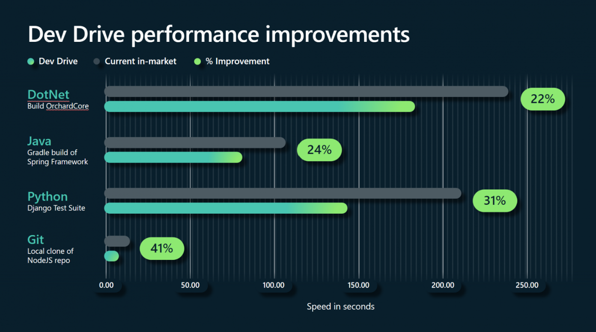

# Microsoft Dev Drive Performance Competition

*Looking to up your machine performance and stunt on your friends?*

[Dev Drive](https://blogs.windows.com/windowsdeveloper/2023/06/01/dev-drive-performance-security-and-control-for-developers/), a special type of hard drive partition that is optimized for developer workloads, was recently launched on Windows 11 and we want to see if it works for you as well as it works for us.

We're asking developers to submit how much Dev Drive improved their machine performance for a chance to win a Microsoft Developer Badge. All you have to do is build the open-source [Windows Calculator](https://github.com/microsoft/calculator) project both on, and off, Dev Drive and submit your results.

Anyone that posts a build time improvement of 20% or more will qualify to receive a badge.

Read below for further instructions on how to enter.

## How to Enter

### 1. Set Up Dev Drive On Your Machine

Before you can test performance improvements with Dev Drive, you will need to set one up on your machine. This should only take a few minutes, and requires minimal configuration on the user end.

The only requirements are 50 GB of available drive space and at least 8 GB of memory.

See the [Dev Drive documentation](https://docs.microsoft.com/en-us/windows/dev-drive/) to get started.

### 2. Build Windows Calculator

In order to properly test compare build times, you will need to clone the [Calculator project](https://github.com/microsoft/calculator) in two separate locations on your machine. One location will be on your Dev Drive, and the other will be on your normal C drive.

Once you have two separate copies of the project, use Visual Studio to build the project in both locations and record the build times. Make sure to take screenshot of the Visual Studio build output window for each build.

### 3. Submit Your Results

Once you've tested Dev Drive, head over to [this form]() to submit your results. 

You will need to provide the following information:
* Time for both builds.
* Associated screenshots for each build
* A valid email address

Once you've submitted your results, you will be entered into the competition. We will be accepting submissions until March 31st, 2024.

## Check Out Dev Drive
If a competition isn't up your alley, feel free to check out Dev Drive on your own. The team behind Dev Drive put in lots of work to help you improve your developer experience, and even if you don't want a badge, you might still enjoy the benefits it brings to developing on Windows.

If you want to learn more about how Dev Drive works, check out the [Dev Drive documentation](https://docs.microsoft.com/en-us/windows/dev-drive/).