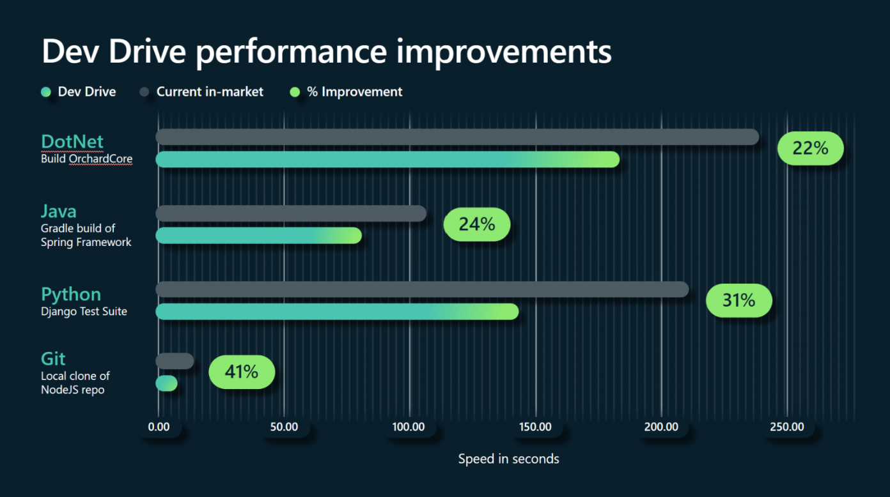

# Microsoft Dev Drive Performance Challenge

[Dev Drive](https://aka.ms/windex/devdrive/docs), a special type of hard drive partition that is optimized for developer workloads, was recently launched on Windows 11 and we want to see if it works for you as well as it works for us.

We're asking developers to submit how much Dev Drive improved their machine performance for a chance to win a Microsoft Developer Badge. All you must do is build one of your own projects both on, and off, Dev Drive and submit your results. The project can be any type of your choosing, from .NET to Python to Node, as long as it can be built on Windows using Dev Drive. Not all project types will see the same performance improvements, so if you have projects on different platforms, we recommend trying several to see which results in the greatest improvement.

Anyone that submits a time improvement will receive a LinkedIn “Dev Drive” badge to display on their profile and be entered for a chance to get their submitted result spotlighted by the Windows Developer social media accounts. 

Read below for prerequisites, rules, and further instructions on how to enter.

## Prerequisites

There are a few things you'll need to have in place before you can participate in the challenge. You'll need:

* A personal computer running version **23H2 or later** of Windows 11
* One or more personal projects that can be built on Windows. Open-source is a bonus, but is not required.
* The minimum space and memory requirements for a Dev Drive partition
    * 50 GB of available drive space
    * 8 GB of RAM

If you check all these boxes, continue below for guidance on how to enter the challenge.

## How to Enter 

Follow the below steps to enter the challenge:

### 1. Set Up Dev Drive on Your Machine 

Before you can test performance improvements with Dev Drive, you will need to set one up on your machine. Dev Drive ships with the latest versions of Windows 11 (minimum build 23H2) and should only take a few minutes and minimal configuration to get one set up on your machine,

See the [Dev Drive documentation](https://aka.ms/windex/devdrive/docs) to get started.

### 2. Build Your Project on Both Drives
To properly test compare build times, you will need to place your project in two separate locations on your machine. One location will be on your Dev Drive, and the other will be on your normal drive. You can choose any platform or language that you would like, but you might see different performance improvements depending on your choice.

Once you have two separate copies of the project, use your normal process to build the project and record the build times.  Take a screenshot of your execution times for later submission. Interested in submitting a clip of your screen recording? Even better!  

If you need guidance on how to record process times, see the below documentation:

### 3. Submit Your Results

Once you've tested Dev Drive, there are two ways to submit your results.

#### *Through Social Media*

The first option for submitting your results is to create a post on a social media platform of your choice that includes:
•	The language/type of project you built, and a link to the project if it is open source
•	Screenshots or a recorded video clip including the build times for both rounds
•	The hashtags #WinDev and #DevDriveSweepstakes

#### *Form Submission*

If you don’t want to post on social media , you can also make a submission via form.

You will need to provide the following information:
•	Time for both builds
•	Associated screenshots or a recorded video clip for the builds
•	The type of project you are building/a link to the repository
•	(Optional) Info about the configuration of your Dev Drive

The form can be found [here.]()

Once you've submitted your results, you will be entered into the competition. We will be accepting submissions until April 30th, 2024.  

## Check Out Dev Drive  

If a competition isn't up your alley, feel free to check out Dev Drive on your own. The team behind Dev Drive put in lots of work to help you improve your developer experience, and even if you don't want a badge, you might still enjoy the benefits it brings to developing on Windows.

If you want to learn m ore about how Dev Drive works, check out the [Dev Drive documentation.](https://aka.ms/windex/devdrive/docs)

Additionally, if you have any feedback related to upcoming Dev Drive features, head over to [this thread.](https://aka.ms/windex/devdrive/feedback)
