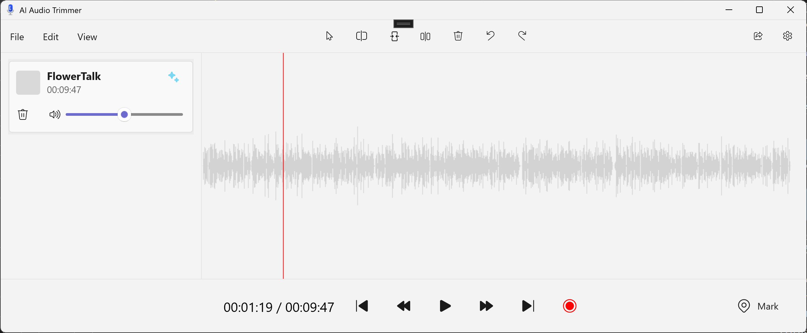

# AI Audio Editor Walkthrough

This sample is intended as a showcase of transcription and language models running locally on Windows in the context of a WinAppSDK/WinUI 3 application.    



The AI functionality of the app is as follows:
* Load in an audio file
* Audio file is transcribed to text on file upload and stored on the filesystem
* After transcription is finished, the user can ask for a snippet of specific duration to be cut from the audio file using a keyword or phrase to do a semantic search on
* The new, cut audio centered around the keyword is loaded into the audio player for preview

For example, if you loaded in a podcast, `FlowerTalk.mp3`, about different flower species and wanted a 45 second snippet about sunflowers, you would set the duration to 45 seconds and the keyword to "sunflower". The app would then cut out whichever 45 second snippet of the podcast is most relevant to sunflowers and load it into the audio player for you to listen to.

## Set Up

You will need to have Visual Studio installed with the latest workloads for WinAppSDK and WinUI 3 development. You can find instructions on how to set up your environment [here.](https://learn.microsoft.com/en-us/windows/apps/windows-app-sdk/set-up-your-development-environment?tabs=cs-vs-community%2Ccpp-vs-community%2Cvs-2022-17-1-a%2Cvs-2022-17-1-b#install-visual-studio)

Clone the repository and open the solution in Visual Studio. Before you can get started exploring the sample, you will need to get the three model files required for the project. Two of these models can be sourced from online repositories, while the third will have to be generated using Olive. All of them should be added under `/Resources/Models/`, and here's a breakdown and how to fetch them:

### MiniLM 
You can pull this model from Hugging Face at [all-MiniLM-L6-v2.onnx](https://huggingface.co/optimum/all-MiniLM-L6-v2) .

This is model we use for semantic search. The two files you will need are `all-MiniLM-L6-v2.onnx` placed in `/Resources/Models/` and `vocab.txt` that should be added under `/Resources/`.

### Sliero VAD
The Sliero Voice Activity Detection model can be found in [this GitHub Repo](https://github.com/snakers4/silero-vad/tree/master). 

This is the model we use for smart chunking of audio and the only file you will need is the `/files/sliero_vad.onnx` file. This should also be placed under `/Resources/Models`.

### Whisper
The process for getting the Whisper model is a bit more involved, as it needs to be manually generated with [Olive](https://github.com/microsoft/OLive).

This can all be done from the command line and only requires Python as a dependency, to get your model, follow these steps:

1. Clone the Olive repository and navigate to the Whisper example folder:
```
git clone https://github.com/microsoft/Olive
cd Olive/examples/whisper
```

2. Install the required packages:
```
pip install olive-ai
python -m pip install -r requirements.txt
pip install onnxruntime
pip install onnxruntime_extensions
```

3. Prepare the Whisper model
```
python prepare_whisper_configs.py --model-name=openai/whisper-tiny --multilingual --enable_timestamps 
```

4. Run the Olive workflow to generate the optimized model
```
olive run --config whisper_cpu_int8.json --setup
olive run --config whisper_cpu_int8.json
```

5. The generated model will be in the \models\conversion-transformers_optimization-onnx_dynamic_quantization-insert_beam_search-prepost folder. 

6. Rename the model from `whisper_cpu_int8_cpu-cpu_model.onnx` to `whisper_tiny.onnx` and place it under `/Resources/Models`.

### Run the solution

Once you have all the model files placed in the proper locations, you can test the sample by running it in Visual Studio.

## Using the App

Using the app is pretty straightforward. Once the app is launched, to test the AI functionality:

1. Click `File > Open` to select an Audio file to be loaded into the player.

2. Click the blue sparkle icon on the audio card to open the AI trimmer dialog.

3. Enter your desired fields.

4. Click `Generate`.

5. Wait for your new audio clip to be created.

6. Play your new audio clip to test how relevant the result is!

## AI Pipeline

When processing your audio, the app will go through the following steps with three different models:

### Smart Chunking with Sliero Voice Activity Detection

The first model we use is the Sliero Voice Activity Detection model. For some context, Whisper (the model we use for transcription) is limited to processing only thirty seconds of audio, we need to "chunk" longer audios into smaller segments. We could do this naively, and just chunk at every 30 second increment in the audio, but this would result in the audio being cut at non-optimal points, such as in the middle of a sentence.

To solve this problem, we use the Sliero model to detect speech patterns and chunk around those speech patterns to keep our chunks logical and easier to transcribe with Whisper.

If you want to dive into the logic behind the Sliero model, take a look at the [`SmartChunking` function](https://github.com/microsoft/Windows-DevRel/blob/0e3908124f67f4fcbd75f595ae9835583696ed23/Projects/AudioEditor/Libs/VoiceActivity/Chunking.cs#L41) in the `/Libs/VoiceActivity/Chunking.cs` file.


### Transcription with Whisper

Once our audio is chunked, we can use the Whisper model to transcribe our audio. We make use of the `whisper-tiny` variant to optimize for speed at only slight cost of accuracy.

Chunking and transcription takes place at time of file upload and is stored on the file system to save time when the semantic search functionality is requested.

The transcription logic using whisper can be found in the [`TranscribeAsync` function](https://github.com/microsoft/Windows-DevRel/blob/0e3908124f67f4fcbd75f595ae9835583696ed23/Projects/AudioEditor/Libs/VoiceRecognition/Whisper.cs#L210) found in the `/Libs/VoiceRecognition/Whisper.cs` file.

### Semantic Search with MiniLM Embeddings

The last step of our pipeline is to execute the semantic search on the transcribed audio file.

This has a few steps, but entry point for the logic can be found in the [`ApplySemanticSearch` function](https://github.com/microsoft/Windows-DevRel/blob/b8732a1d6e39bfa9a434e9e8d7ed70cea6fbc376/Projects/AudioEditor/MainWindow.xaml.cs#L288) in `MainWindow.xaml.cs`.

We can step through this function:

```csharp
private List<TranscribedChunk> ApplySemanticSearch(List<TranscribedChunk> listOfChunks, string searchQuery, int durationSeconds = 30)
{
    var miniLM = new MiniLML6v2(new MiniLML6v2Config());

    listOfChunks = Utils.CreateDurationSizedChunkWindows(listOfChunks, durationSeconds);

    string[] corpusArray = listOfChunks.Select(x => x.Transcript).ToArray();

    string[] searchQueryArray = { searchQuery };

    // Generate embeddings for the corpus
    var corpusEmbeddings = corpusArray
        .Select(text => miniLM.GenerateEmbeddings(new string[] { text }))
        .ToArray();

    // Generate embeddings for the search query
    var searchQueryEmbeddings = miniLM.GenerateEmbeddings(searchQueryArray); // Assuming one query

    // Calculate similarities
    var similarityScores = corpusEmbeddings
        .Select(embedding => Similarity.CosineSimilarity(searchQueryEmbeddings, embedding))
        .ToArray();

    // Order by similarity in desc order and select indexes
    var sortedIndexBySimilarity = similarityScores
        .Select((score, index) => new { Index = index, Score = score, Text = corpusArray[index] })
        .OrderByDescending(x => x.Score)
        .Select(x => listOfChunks[x.Index]).ToList();

    var relevantSnips = Utils.GenerateRelevantSnipsWithDuration(sortedIndexBySimilarity, durationSeconds);


    return relevantSnips;
}
```

The inputs for this function is a list of `TranscribedChunks` that we got from our transcription process, a string that we will query our transcription on for similarity, and a duration for a length of audio clip we want to generate.

The logic is as follows:

1. Initialize a new MiniLM model, this model will be used to create text embedding vectors for both our transcription and search query, so that similarity scores can be calculated for our query.

2. Create a list of "duration windows". This basically a set of transcribed sections created with a sliding window that is the same duration of our desired audio clip length.

3. Next, we grab the transcription from each of these chunks as a string, and add them to a string array of all our transcribed windows.

4. We then use the MiniLM model to generate embeddings for both our transcription windows and the query itself.

5. We then use the `Similarity.CosineSimilarity` function, which is defined in `Similarity.cs` to get similarity scores for each of our windows relative to our search query.

6. We then sort the list by similarity, and return the snips that will produce the most relevant audio clip to our search query.

Once we have the output data, we can cut our original audio to produce the new audio clip, and load it into the Audio Player.
