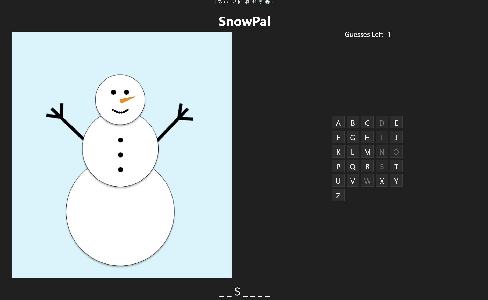

# Win 101: Snowpal

This sample is intended as beginner sample that showcase a word guessing game app that uses WinUI, Windows App SDK and Windows Community Toolkit. This sample is the final app that is built in the [WinUi 101](https://learn.microsoft.com/training/modules/winui-101/) lab.



In this SnowPal game, the app selects a word for the user to guess, displaying it as a series of blank spaces where each space represents a letter. The player guesses letters one at a time; for every incorrect guess, part of the SnowPal character melts away. If the player guesses all letters before exhausting their turns, they win; otherwise, they lose.

## How to run

Recommend to complete [WinUi 101](https://learn.microsoft.com/training/modules/winui-101) lab.

1. Complete [Developer Setup](https://learn.microsoft.com/en-us/windows/apps/get-started/start-here)
2. Clone the repository

```powershell
git clone https://github.com/microsoft/Windows-DevRel.git
```

3. In Visual Studio, select `Open a project or solution`
4. Select `Windows-DevRel/Samples/SnowPal-Win-101/SnowPal.sln`

Run the project:

5. On the title bar, **Click** on **Debug** > **Start Debugging** OR on your keyboard press **F5** key
