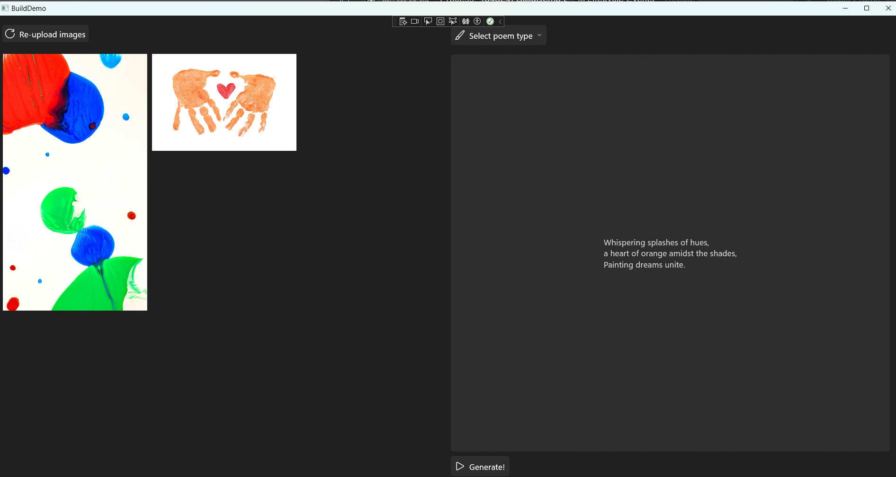

# Overview of Windows Development

Building Windows apps uses modern frameworks and tools to create software that runs on the Windows operating system. This course introduces you to the WinUi, Windows App SDK, Windows Copilot Runtime APIs, and the Windows Community Toolkit. These frameworks and tools provide a foundation for developing high-performance, visually consistent applications that use the latest Windows features and maintain compatibility across devices.

*WinUI* is the user interface framework included in the Windows App SDK. WinUI enables you to build applications with Fluent Design and modern controls. You can use WinUI to create intuitive, accessible, and visually appealing user experiences.

The *Windows App SDK* supplies libraries, frameworks, and components for accessing Windows platform functionality in both new and existing desktop apps. You can use these resources with C++ Win32 or C# .NET projects. The SDK supports features such as modern window management, improved text rendering, and application lifecycle management. You can add these features to your app without rewriting existing code.

The *Windows Copilot Runtime APIs* allow you to integrate AI capabilities into your Windows apps. These APIs include features such as text content moderation, which helps flag and filter potentially harmful content. You can use these APIs to enhance your applications with responsible generative AI functionality.

The *Windows Community Toolkit() provides additional helpers, controls, and extensions for Windows app development. You can use this toolkit to simplify common tasks and accelerate your development process.

You use these frameworks and tools together to build Windows apps that are modern, efficient, and compatible with a wide range of Windows devices

## Scenario
Jamie has a young child who enjoys hearing a different bedtime story every night. The child often returns home from daycare with new arts and crafts projects, inspiring Jamie to create a more personalized bedtime experience. Jamie wants an app that uses images of these arts and crafts to generate unique bedtime stories.

At the same time, Jamie is concerned about privacy and wants to ensure that no images of her child or their creations are uploaded to online AI models or external services.

## App Description
You will build a Windows app that generates poems from images of children’s arts and crafts, while keeping all data and AI processing on the device for privacy.

The app uses the Windows App SDK and WinUI to provide a modern, intuitive, and accessible user experience. You will design the interface with XAML, use data binding to connect UI elements to data, and apply styles and controls to create an engaging application.

To generate poems, you will integrate Windows Copilot Runtime APIs. The app uses the Image Description API to create a detailed narration of each arts and crafts image. This narration is then passed to the Phi Silica language model, which generates a unique poems—all running locally on your device for privacy and security.

You will test the app to ensure it creates personalized bedtime stories from images, with all features operating securely and locally.

## Software Architecture

For this course, we’ll use three key terms -— **View**, **ViewModel**, and **Model** -— to represent distinct parts of our application architecture:

- The **View** term refers to the User Interface (UI) of the application. This View component displays data to users and handles user interactions.
- The **ViewModel** term handles presentation logic and transforms data from the Model into a form that the View can easily display.
- The **Model** term represents the data and business logic of the application.

These three components form the Model-View-ViewModel (MVVM) software architecture design. Using an MVVM approach allows us to build applications with clear separation of concerns between UI and logic. This MVVM approach makes your application easier to develop, test, and maintain. It also fosters better communication among developers by ensuring each component remains focused on its specific purpose.

The **ViewModel** component performs the databinding between View and Model components. This databinding enables automatic propagation of data changes in both directions. The ViewModel handles syncing raw Model data to reflect UI changes automatically. If the user makes a change, the View updates the ViewModel, which can then update the Model and notify the View.

This bi-directional syncing between View and Model components allows us to have functionality that enables a user to press a letter button in our game. This button press triggers the ViewModel to both update the View (by disabling the button) and the Model (by processing the user's guessed letter).

Now that you have an overview of Windows development tools and our project goals for this course, let's dive in and start building this Windows app!

Next [Developer Setup](../2-dev-setup.md)