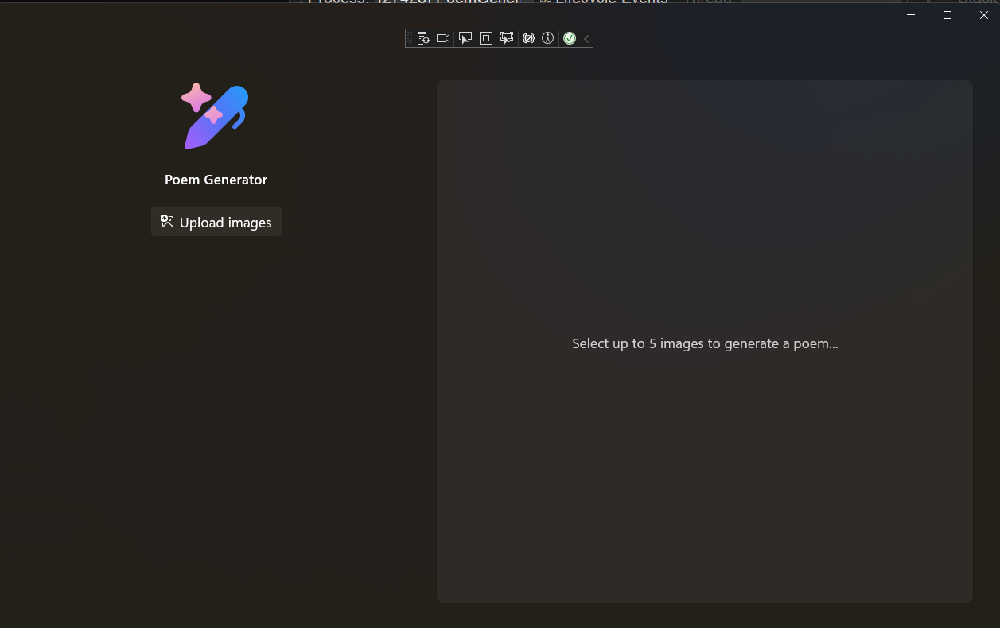

# Overview of Windows Development

Want to build apps for Windows with the latest and greatest capabilities? You’ve come to the right Lab! Today, we’ll build a WinUI app that leverages WCR APIs from start to finish.

This Lab walks you building a windows app using WinUI, the Windows App SDK, Windows Copilot Runtime APIs, and the Windows Community Toolkit. These frameworks and tools provide a foundation for developing high-performance, visually consistent applications that use the latest Windows features and maintain compatibility across devices.

Building Windows apps uses modern frameworks and tools to create software that runs on the Windows operating system. This course introduces you to the WinUi, Windows App SDK, Windows Copilot Runtime APIs, and the Windows Community Toolkit.

**WinUI** is a powerful and versatile framework that offers developers a native user experience (UX) for both Windows desktop and Universal Windows Platform (UWP) applications. By incorporating the Fluent Design System into all experiences, controls, and styles, WinUI provides consistent, intuitive, and accessible experiences using the latest user interface (UI) patterns. This means that developers can create visually appealing and highly functional applications that align with modern design principles, ensuring a seamless and engaging user experience.

One of the key advantages of WinUI is its flexibility and compatibility with various development targets. Whether you are building a new application from scratch or migrating an existing [UWP](https://learn.microsoft.com/en-us/windows/uwp/get-started/) (Universal Windows Platform), [WinForms](https://learn.microsoft.com/en-us/dotnet/desktop/winforms/overview/?view=netdesktop-9.0), or [WPF](https://learn.microsoft.com/en-us/windows/apps/get-started/?tabs=cpp-win32%2Cnet-maui#wpf/dotnet/desktop/wpf/overview/?view=netdesktop-9.0) (Windows Presentation Foundation) app, WinUI supports a wide range of languages including C++, C#, Visual Basic, and JavaScript (using React Native for Desktop). This makes it easier for developers to leverage their existing skills and codebases while adopting the latest technologies. Additionally, WinUI is decoupled from the OS and Windows SDKs, allowing for more frequent updates and improvements without being tied to specific Windows releases. This ensures that developers can always access the latest features and enhancements, keeping their applications up-to-date and competitive.

**Windows App SDK (WASDK)** is a comprehensive framework that unifies access to Windows APIs for desktop applications on Windows 11 and Windows 10. It provides developers with a consistent set of tools and libraries to build modern, high-performance applications. One of the standout features of the Windows App SDK is its integration with WinUI 3, the premier native user interface (UI) framework for Windows desktop apps. The WASDK supplies libraries, frameworks, and components for accessing Windows platform functionality in both new and existing desktop apps. You can use these resources with C++ Win32 or C# .NET projects. The SDK supports features such as modern window management, improved text rendering, and application lifecycle management. You can add these features to your app without rewriting existing code.

The **Windows Copilot Runtime APIs** (WCR APIs) offer a powerful suite of AI-powered features that enable developers to integrate advanced AI capabilities into their applications without the need to find, run, or optimize their own Machine Learning (ML) models. These APIs leverage on-device AI models that run locally and continuously in the background on Copilot+ PCs, ensuring high performance and security. The initial set of APIs includes Phi Silica for language processing, Text Recognition, Image Super Resolution, Image Segmentation, and Image Description. By utilizing these APIs, developers can enhance their applications with features such as text generation, image sharpening, and natural language image descriptions, all running directly on the user's device.

The **Windows Community Toolkit** is an invaluable resource for developers building applications on Windows. It is a collection of helper functions, custom controls, and app services designed to simplify and demonstrate common developer tasks. The toolkit supports a wide range of development targets, including WinUI 2, WinUI 3, and the Uno Platform, making it a versatile choice for developers working on different types of projects. By leveraging the Windows Community Toolkit, developers can access a rich set of controls and extensions that enhance productivity and streamline the development process.

You use these frameworks and tools together to build Windows apps that are modern, efficient, and compatible with a wide range of Windows devices.

## Scenario

Jamie has a young child who enjoys hearing a different bedtime story every night. The child often returns home from daycare with new arts and crafts projects, inspiring Jamie to create a more personalized bedtime experience using those projects. Jamie wants an app that uses images of these arts and crafts to generate unique bedtime stories.

At the same time, Jamie is concerned about privacy and wants to ensure that no images of her child or their creations are uploaded to online AI models or external services.

## App Description

You will build a Windows app that generates poems from images of children’s arts and crafts, while keeping all data and AI processing on the device for privacy.

The app uses the Windows App SDK and WinUI to provide a modern, intuitive, and accessible user experience. You will design the interface with XAML, use data binding to connect UI elements to data, and apply styles and controls to create an engaging application.

To generate poems, you will integrate Windows Copilot Runtime APIs. The app uses the Image Description API to create a detailed description of each arts and crafts image. This narration is then passed to the Phi Silica small language model, which generates unique poems—all running locally on-device for privacy and security.

You will test the app to ensure it creates personalized bedtime stories from images, with all features operating securely and locally.

## Software Architecture

For this course, we’ll use three key terms -— **View**, **ViewModel**, and **Model** -— to represent distinct parts of our application architecture:

- The **View** term refers to the User Interface (UI) of the application. This View component displays data to users and handles user interactions.
- The **ViewModel** term handles presentation logic and transforms data from the Model into a form that the View can easily display.
- The **Model** term represents the data and business logic of the application.

These three components form the Model-View-ViewModel (MVVM) software architecture design. Using an MVVM approach allows us to build applications with clear separation of concerns between UI and logic. This MVVM approach makes your application easier to develop, test, and maintain. It also fosters better communication among developers by ensuring each component remains focused on its specific purpose.

The **ViewModel** component performs the databinding between View and Model components. This databinding enables automatic propagation of data changes in both directions. The ViewModel handles syncing raw Model data to reflect UI changes automatically. If the user makes a change, the View updates the ViewModel, which can then update the Model and notify the View.

> **_Note:_**  This lab will not strictly adhere to MVVM, it also include codebehind patterns as well.

Now that you have an overview of Windows development tools and our project goals for this course, let's dive in and start building this Windows app!

Next [Developer Setup](./2-dev-setup.md)