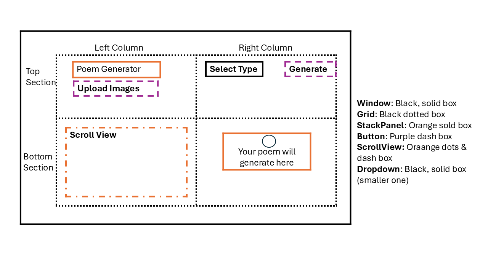
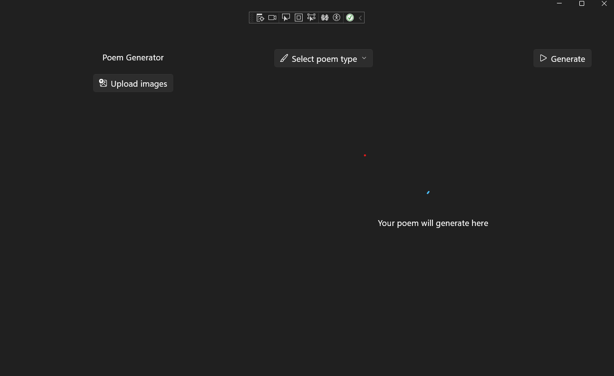

# Build UI

In this module, you'll construct a user interface (UI) for a WinUI 3 application using XAML. You'll start by setting up the main window and then structuring the app's UI with grids, stacks, and controls, to create a layout for image selection and poem generation. By the end of this module, you will have created the base layout for your application that you will add functionality to in the next module.

## XAML

In WinUI 3, XAML defines the app’s UI using an XML-based syntax to describe layout, appearance, and element hierarchy. It enables declarative UI construction, such as a button with properties and event bindings:

```xml
<Button Content="Click Me" Click="myButton_Click" Width="100" Height="50" HorizontalAlignment="Center" VerticalAlignment="Center"/>
```

Each XAML file pairs with a code-behind C# file (.xaml.cs) that implements event handlers, UI initialization, and view-specific logic. While MVVM encourages minimizing code-behind, it remains essential for handling UI events or operations that data binding cannot address:

```c#
public sealed partial class MainWindow : Window
{
    public MainWindow()
    {
        this.InitializeComponent();
    }

    private void myButton_Click(object sender, RoutedEventArgs e)
    {
        // Handle button click
    }
}

```

MainWindow.xaml acts as the root window container hosting navigable Page element. Unlike WPF or UWP, WinUI 3’s Window element has limitations, so structuring apps with pages and grids is recommended for better flexibility and maintainability.

## Setting Up MainWindow

1. In the Solution Explorer, open `MainWindow.xaml` by double clicking
1. Delete `<StackPanel>` and `<Button>` elements
1. Add to the Window's element: `<Frame x:Name="MainFrame" />`

```xaml
<?xml version="1.0" encoding="utf-8"?>
<Window
    x:Class="PoemGenerator.MainWindow"
    xmlns="http://schemas.microsoft.com/winfx/2006/xaml/presentation"
    xmlns:x="http://schemas.microsoft.com/winfx/2006/xaml"
    xmlns:local="using:SnowPal"
    xmlns:d="http://schemas.microsoft.com/expression/blend/2008"
    xmlns:mc="http://schemas.openxmlformats.org/markup-compatibility/2006"
    mc:Ignorable="d">

    <Frame x:Name="MainFrame" />

</Window>
```

1. Open `MainWindow.xaml.cs`
    1. if you do not see the file, click on the arrow next to `MainWindow.xaml`
1. Add to the imports, located at the top of the file:

```c#
using PoemGenerator.Pages;
using Windows.Graphics;
```

1. Delete `myButton_Click` function.
1. In the constructor, after `InitializeComponent();` add:

```c#
 MainFrame.Navigate(typeof(MainPage));

 this.AppWindow.Resize(new SizeInt32(1280, 800));
 this.ExtendsContentIntoTitleBar = true;
```

> **_Important:_** Visual Studio will display errors because you are actively developing. If you see error you can ignore until the end of the section or when you are ask to run the app.

Now the MainWindow constructor is responsible for navigating the Frame control named MainFrame to display the MainPage when the application starts. It also resizes the default window and hide the default title bar.

<details>
  <summary>Your code should look like the following:</summary>
  
  ```c#
    using PoemGenerator.Pages;
    using Windows.Graphics;

namespace PoemGenerator
{
    public sealed partial class MainWindow : Window
    {
        public MainWindow()
        {
            InitializeComponent();
            MainFrame.Navigate(typeof(MainPage));

            this.AppWindow.Resize(new SizeInt32(1280, 800));
            this.ExtendsContentIntoTitleBar = true;
        }
    }
}
  ```
</details>

Next to create the MainPage:

1. In the Solution Explorer, **Right Click** your new **Pages Folder** > **Add** > **New Item....**  
    - if you do not see **New Item....**, select **Class....**
1. In the **Add New Item** dialog, select **WinUI** in the template list on the left-side of the window.
    1. Or on the top right, there is a Search bar, enter **Blank Page (WinUI 3)** 
1. Select the **Blank Page (WinUI 3)** template.
1. Name the file **MainPage.xaml**
1. **Click Add**

These steps creates both `MainPage.xaml` & `MainPage.xaml.cs`. Theses files are part of the View. `.xaml` contains the XAML content and the `.xaml.cs` contains the code-behind.

## App's UI Structure

1. Open `MainPage.xaml`
1. Replace the `<Grid>` element with the following:

```xml
<!--Photo viewer-->
<Grid Padding="36,96,36,36"
  ColumnSpacing="36">
    <Grid.ColumnDefinitions>
        <ColumnDefinition Width="480"/>
        <ColumnDefinition Width="*"/>
    </Grid.ColumnDefinitions>

    <Grid RowSpacing="36">
        <Grid.RowDefinitions>
            <RowDefinition Height="Auto"/>
            <RowDefinition Height="*"/>
        </Grid.RowDefinitions>

        <StackPanel
        HorizontalAlignment="Center"
        Orientation="Vertical"
        Spacing="16">
            <Image Width="96" Source="/Assets/AppIcon.svg" />
            <TextBlock
            HorizontalAlignment="Center"
            Text="Poem Generator" />
            <Button
            Margin="0,8,0,0"
            HorizontalAlignment="Center"
            AutomationProperties.Name="Select up to 5 images"
            Click="LoadImage_Click"
            ToolTipService.ToolTip="Select images">
                <StackPanel Orientation="Horizontal"
                        Spacing="8">
                    <FontIcon FontSize="16"
                          Glyph="&#xEE71;"/>
                    <TextBlock Text="Upload images"/>
                </StackPanel>
            </Button>
        </StackPanel>
        <ScrollView Margin="0,16,0,0" Grid.Row="1">
            <!--Images-->
            <Image></Image>
        </ScrollView>
    </Grid>

    <!--Poem viewer-->
    <Grid
    Grid.Column="1"
    Padding="12"
    BorderThickness="1">

        <Grid.RowDefinitions>
            <RowDefinition Height="Auto" />
            <RowDefinition Height="*" />
        </Grid.RowDefinitions>

        <Grid>
            <DropDownButton AutomationProperties.Name="Select poem type" ToolTipService.ToolTip="Select poem type">
                <DropDownButton.Flyout>
                    <MenuFlyout Placement="Bottom">
                        <MenuFlyoutItem Text="Sonnet" Click="MenuFlyoutItem_Click"/>
                        <MenuFlyoutItem Text="Haiku" Click="MenuFlyoutItem_Click"/>
                        <MenuFlyoutItem Text="Elegy" Click="MenuFlyoutItem_Click"/>
                        <MenuFlyoutItem Text="Limerick" Click="MenuFlyoutItem_Click"/>
                        <MenuFlyoutItem Text="Ballad" Click="MenuFlyoutItem_Click"/>
                        <MenuFlyoutItem Text="Free verse" Click="MenuFlyoutItem_Click"/>
                    </MenuFlyout>
                </DropDownButton.Flyout>
                <StackPanel Orientation="Horizontal" Spacing="8">
                    <FontIcon FontSize="16" Glyph="&#xE771;" />
                    <TextBlock x:Name="PoemTypeDropdownText" Text="Select poem type" />
                </StackPanel>
            </DropDownButton>

            <Button HorizontalAlignment="Right"
          AutomationProperties.Name="Generate poem from selected images"
          ToolTipService.ToolTip="Select images">
                <StackPanel Orientation="Horizontal" Spacing="8">
                    <FontIcon FontSize="16" Glyph="&#xE768;" />
                    <TextBlock Text="Generate" />
                </StackPanel>
            </Button>
        </Grid>

        <StackPanel
        Grid.Row="1"
        HorizontalAlignment="Center"
        VerticalAlignment="Center"
        Spacing="8">

            <ProgressRing
            x:Name="Loader"
            Width="32"
            Height="32"
            IsActive="True"
            Visibility="Visible" />

            <RichTextBlock
            Margin="16"
            TextAlignment="Center">
                <Paragraph>
                    <Run Text="Your poem will generate here"/>
                </Paragraph>
            </RichTextBlock>
        </StackPanel>
    </Grid>
</Grid>
```



This page is organized into a two-column grid: the left column (fixed width) allows users to upload and view images, while the right column (flexible width) provides controls to select a poem type, generate the poem, and display the result. The left side includes an app icon, title, upload button, and image viewer, and the right side features a dropdown for poem types, a generate button, a loading indicator, and a poem display area.

The XAML includes a two onClick Event, which will need to be handled before you can run and see the project.

1. Open MainPage.xaml.cs
1. **Under** the MainPage constructor, which is `public MainPage()` add:

```c#
private void MenuFlyoutItem_Click(object sender, RoutedEventArgs e)
{
    
}

private void LoadImage_Click(object sender, RoutedEventArgs e)
{
    
}
```

<details>
  <summary>Your code should look like the following:</summary>
  
  ```c#
public sealed partial class MainPage : Page
{
    public MainPage()
    {
        InitializeComponent();
    }

    private void MenuFlyoutItem_Click(object sender, RoutedEventArgs e)
    {
        
    }

    private void LoadImage_Click(object sender, RoutedEventArgs e)
    {
        
    }
    
}
  ```
</details>

You'll manage these functions later in the lab.

Now to test it out:

1. On the title bar, Click on **Debug** > **Start Debugging** OR on your keyboard press **F5** key
1. Close the app



You've completed the initial UI construction for your Poem Generating application. By setting up the main window and structuring the layout with XAML, you've established the foundation for image uploads and poem generation. This visual structure is important for adding functionality and interactivity in the next module.

Next [Add Functionality](./4-add-functionality.md)