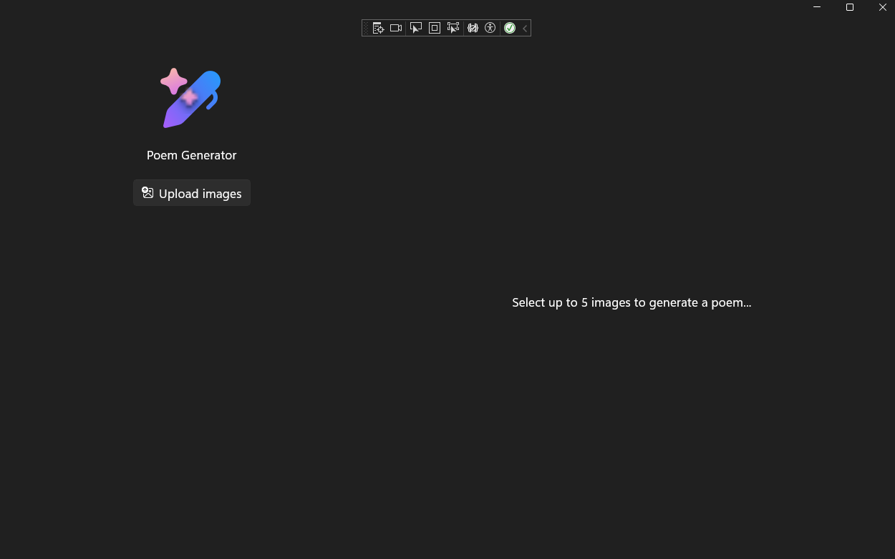
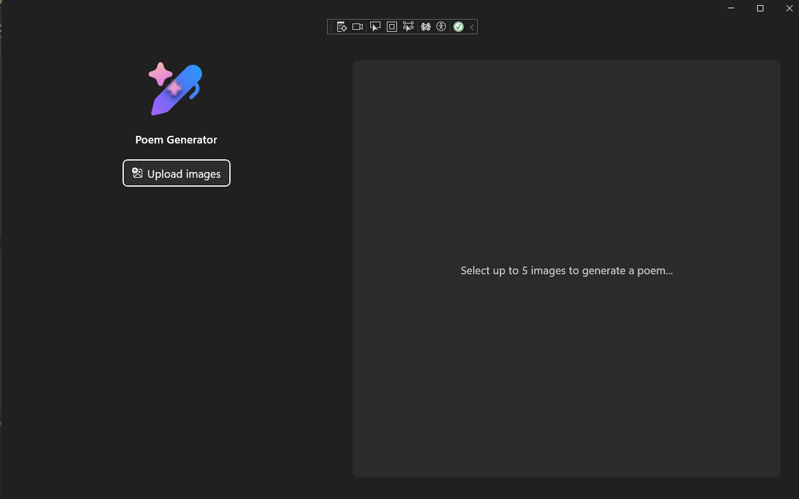

# Adding Style & Icon
This section walks you through the process of enhancing the visual appeal of a XAML page and aligning it with modern Windows design standards. You begin by adding an icon to the application. Then, you transform the look and feel of the page by applying styles and theme resources to UI elements like containers, buttons, and text. This transformation ensures that your app adheres to Windows design principles, offers a consistent user experience, and is easier to maintain and update.

> **_Note:_** You can find a dedicated section discussing the approach to styling updates, along with the complete code, at the end of this article.


# Add Icon to App

In the `MainPage.xmal` there is a `Image` element that contains `Source="/Assets/AppIcon.svg"`. Now its time to add the image to the project.

1. Go to [directory]()
1. Locate AppIcon.svg
1. Download image Desktop
1. Have Visual Studio display Soution Explorer and open `Asset` directory
1. Drag and drop image from Desktop to Visual Stuido into the `Asset` directory
1. **Right click** on the image
1. **Click** on **Properties**
1. A Properties panel will open
1. **Change** the Copy to Output Directory to `Copy if newer`

Now try it out:

1. On the title bar, Click on **Debug** > **Start Debugging** OR on your keyboard press **F5** key



1. Close App


# Adding Style

Below are the key items to transform an XAML page without styling into a visually consistent, modern, and accessible WinUI page that uses styles and theme resources. This process ensures that your app matches Windows design guidance, is maintainable, and is easier to update as design systems evolve.

## Use Theme and Style Resources for Consistent Appearance

Update controls to use styles and theme resources instead of hard-coded property values.

This approach ensures that your app’s look and feel automatically match Windows’ current design language and respond to theme changes (light/dark/high contrast).

**How**:
- For each control, check if the styled version uses a Style or a theme resource (like {ThemeResource ...}).
- For example, update the main TextBlock (the app title) to use Style="{StaticResource BodyStrongTextBlockStyle}" instead of the default style. This makes the title visually prominent and consistent with Windows typography.

**Why**:

Using built-in styles and theme resources provides visual consistency and makes future updates easier, as you only need to update the style or resource rather than every control.

## Add Background, Border, and Corner Styling to Containers

Apply background, border, and corner radius styles to major layout containers (such as the right-side poem viewer grid).

**How:**

Add these attributes to the poem viewer grid:

- Background="{ThemeResource CardBackgroundFillColorDefaultBrush}"
- BorderBrush="{ThemeResource CardStrokeColorDefaultBrush}"
- BorderThickness="1"
- CornerRadius="{StaticResource OverlayCornerRadius}" (if defined in your resources)

**Why**:

These theme resources ensure that this grid looks like a card, visually separating it from the rest of the UI and aligning it with Fluent Design principles.

> **_TIP:_** Define OverlayCornerRadius in your resource dictionary if it’s not already present.

## Style Buttons for Visual Hierarchy

Use accent styles for primary actions (like the "Generate" button).

**How:**

- Add Style="{StaticResource AccentButtonStyle}" to the "Generate" button.

**Why:**

This style highlights the button as a primary action, improving discoverability and accessibility. Using accent styles also ensures the button color matches the system accent color, which users can personalize.

## Apply Foreground Styling for Readability

Use theme resources for foreground colors, especially for text blocks that display dynamic content.

**How:**

- For the RichTextBlock that shows the generated poem, add Foreground="{ThemeResource TextFillColorSecondaryBrush}".

**Why:**

This ensures text remains readable in all themes and meets accessibility guidelines.

## Ensure Consistent Command and Property Bindings

Double-check that command and property names match your ViewModel. For example, update LoadImageCommand to LoadImagesCommand if that’s the correct property.

**How:**

- Review all {x:Bind ...} expressions and update them to match the styled version and your ViewModel’s properties.

**Why:**

This prevents runtime errors and ensures that UI actions are properly connected to your logic.

## Use Spacing and Padding for Layout Consistency

Maintain consistent spacing and padding between controls and within containers.

**How:**

- Use properties like Spacing, Padding, and Margin as shown in the styled version.

- For example, ensure the outer grid uses Padding="36,96,36,36" and ColumnSpacing="36".

**Why:**

Consistent spacing improves readability and touch target size, making your app more usable on all devices.

## Leverage Reusable Resources

Define custom styles or brushes in Page.Resources or App.xaml for reuse.

**How:**

- If you need a custom look, define a style with a TargetType and use it via Style="{StaticResource YourCustomStyle}".

**Why:**

Reusable resources reduce duplication and centralize design updates.

## Tips and Best Practices
- **Prefer built-in styles and theme resources**: This keeps your app aligned with Windows updates and accessibility improvements.
- **Define custom styles only when necessary**: Base them on the default control style for maintainability.
- **Test in light, dark, and high-contrast modes**: Ensure your styles respond correctly to theme changes.
- **Keep resource scope in mind**: Page-level resources override app-level ones. Use app-level resources for global styles.
- **Use clear naming for styles and resources**: This makes your XAML easier to read and maintain.


## Update Project

1. Open `MainPage.xmal`
1. Replace the `Grid` with the following:

```xml
<!--Photo viewer-->
<Grid Padding="36,96,36,36"
      ColumnSpacing="36">
    <Grid.ColumnDefinitions>
        <ColumnDefinition Width="480"/>
        <ColumnDefinition Width="*"/>
    </Grid.ColumnDefinitions>

    <Grid RowSpacing="36">
        <Grid.RowDefinitions>
            <RowDefinition Height="Auto"/>
            <RowDefinition Height="*"/>
        </Grid.RowDefinitions>

        <StackPanel
            HorizontalAlignment="Center"
            Orientation="Vertical"
            Spacing="16">
            <Image Width="96" Source="/Assets/AppIcon.svg" />
            <TextBlock
                HorizontalAlignment="Center"
                Style="{StaticResource BodyStrongTextBlockStyle}"
                Text="Poem Generator" />
            <Button
                Margin="0,8,0,0"
                HorizontalAlignment="Center"
                AutomationProperties.Name="Select up to 5 images"
                Command="{x:Bind ViewModel.LoadImagesCommand}"
                ToolTipService.ToolTip="Select images">
                <StackPanel Orientation="Horizontal"
                            Spacing="8">
                    <FontIcon FontSize="16"
                              Glyph="&#xEE71;"/>
                    <TextBlock Text="Upload images"/>
                </StackPanel>
            </Button>
        </StackPanel>
        <ScrollView Margin="0,16,0,0" Grid.Row="1">
            <ItemsView
                ItemTemplate="{StaticResource PhotoTemplate}"
                ItemsSource="{x:Bind ViewModel.Photos, Mode=OneWay}"
                Visibility="{x:Bind ViewModel.PhotosLoaded, Mode=OneWay}">
                <ItemsView.Layout>
                    <LinedFlowLayout
                        ItemsStretch="Fill"
                        LineHeight="160"
                        LineSpacing="16"
                        MinItemSpacing="16"/>
                </ItemsView.Layout>
            </ItemsView>
        </ScrollView>
    </Grid>
    
    <!--Poem viewer-->
    <Grid
        Grid.Column="1"
        Padding="12"
        Background="{ThemeResource CardBackgroundFillColorDefaultBrush}"
        BorderBrush="{ThemeResource CardStrokeColorDefaultBrush}"
        BorderThickness="1"
        CornerRadius="{StaticResource OverlayCornerRadius}">

        <Grid.RowDefinitions>
            <RowDefinition Height="Auto" />
            <RowDefinition Height="*" />
        </Grid.RowDefinitions>

        <Grid Visibility="{x:Bind ViewModel.PhotosLoaded, Mode=OneWay}">
            <DropDownButton AutomationProperties.Name="Select poem type" ToolTipService.ToolTip="Select poem type">
                <DropDownButton.Flyout>
                    <MenuFlyout Placement="Bottom">
                        <MenuFlyoutItem Text="Sonnet" Click="MenuFlyoutItem_Click"/>
                        <MenuFlyoutItem Text="Haiku" Click="MenuFlyoutItem_Click"/>
                        <MenuFlyoutItem Text="Elegy" Click="MenuFlyoutItem_Click"/>
                        <MenuFlyoutItem Text="Limerick" Click="MenuFlyoutItem_Click"/>
                        <MenuFlyoutItem Text="Ballad" Click="MenuFlyoutItem_Click"/>
                        <MenuFlyoutItem Text="Free verse" Click="MenuFlyoutItem_Click"/>
                    </MenuFlyout>
                </DropDownButton.Flyout>
                <StackPanel Orientation="Horizontal" Spacing="8">
                    <FontIcon FontSize="16" Glyph="&#xE771;" />
                    <TextBlock x:Name="PoemTypeDropdownText" Text="Select poem type" />
                </StackPanel>
            </DropDownButton>

            <Button HorizontalAlignment="Right"
              AutomationProperties.Name="Generate poem from selected images"
              Style="{StaticResource AccentButtonStyle}"
              ToolTipService.ToolTip="Select images"
              Command="{x:Bind ViewModel.GeneratePoemCommand}">
                <StackPanel Orientation="Horizontal" Spacing="8">
                    <FontIcon FontSize="16" Glyph="&#xE768;" />
                    <TextBlock Text="Generate" />
                </StackPanel>
            </Button>
        </Grid>

        <StackPanel
            Grid.Row="1"
            HorizontalAlignment="Center"
            VerticalAlignment="Center"
            Spacing="8">
            
            <ProgressRing
                x:Name="Loader"
                Width="32"
                Height="32"
                IsActive="{x:Bind ViewModel.IsGeneratingPoem, Mode=OneWay}"
                Visibility="{x:Bind ViewModel.IsGeneratingPoem, Mode=OneWay}" />

            <RichTextBlock
                Margin="16"
                Foreground="{ThemeResource TextFillColorSecondaryBrush}"
                TextAlignment="Center">
                <Paragraph>
                    <Run Text="{x:Bind ViewModel.GeneratedPoem, Mode=OneWay}"/>
                </Paragraph>
            </RichTextBlock>
        </StackPanel>
    </Grid>
</Grid>
```


> **_NOTE:_** It might take Visual Studio a min to update the ViewModel linking

Now try it out:

1. On the title bar, Click on **Debug** > **Start Debugging** OR on your keyboard press **F5** key



1. Close App


You successfully updated the app's UI to use modern styling techniques. By incorporating theme resources, applying consistent styles, and adding visual cues, you have created an application that aligns with Windows design principles. This approach not only improves the app's appearance, but also ensures it remains maintainable and adaptable to future design updates.


Next [Add AI](./6-phi-silica.md)