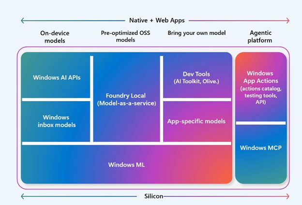
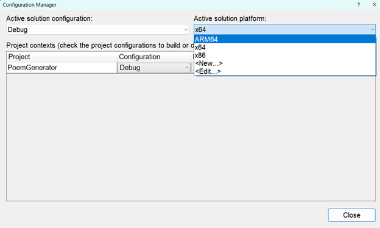

# Windows Copilot Runtime

Windows Copilot Runtime provides AI-powered features and APIs on Copilot+ PCs. These features are in active development and run locally in the background at all times.



## Choose between cloud-based and local AI services
You can integrate AI into your Windows application using either a local model or a cloud-based model. Consider the following aspects:

- Resource Availability
    - Local device: Running a model depends on the device’s CPU, GPU, NPU, memory, and storage. Small Language Models (SLMs), such as Phi, are suitable for local use. Copilot+ PCs include built-in models managed by Windows Copilot Runtime.
    - Cloud: Cloud platforms, such as Azure AI Services, provide scalable resources. Large Language Models (LLMs), such as OpenAI language models, require more resources and are available through the cloud.
- Data Privacy and Security
    - Local device: Data remains on the device, which can benefit privacy and security.
    - Cloud: Data is transferred to the cloud, which may raise privacy concerns.
- Accessibility and Collaboration
    - Local device: The model and data are accessible only on the device unless shared manually.
    - Cloud: The model and data can be accessed from anywhere with internet connectivity.
- Cost
    - Local device: There is no additional cost beyond the device hardware.
    - Cloud: Costs are based on usage and resources consumed.
- Maintenance and Updates
    - Local device: The user is responsible for maintenance and updates.
    - Cloud: The cloud provider manages maintenance and updates.

### Local AI services

**Use a custom model on your local machine**: You can train your own model using platforms like TensorFlow or PyTorch. You can integrate this custom model into your Windows application by running it locally with ONNX Runtime and AI Toolkit for Visual Studio Code.

**Use Windows Copilot Runtime**: When a local AI model is appropriate, you can use Windows Copilot Runtime features on Copilot+ PCs. Available features include:

- **Phi Silica**: a local, ready-to-use language model.
- **Recall**: a UserActivity API that uses AI to help search through past activity, supported by Click to Do, which uses Phi Silica to connect actions to content found by Recall.
- **AI Imaging**: generate various types of text descriptions for an image (Image Description), for scaling and sharpening images (Image Super Resolution) and identifying objects in images (Image Segmentation).
- **Windows Studio Effects**: for applying AI effects to the device camera or microphone.

Windows Copilot Runtime provides these AI-powered features through APIs. The models run locally and continuously in the background on Copilot+ PCs. These APIs are included in the Windows App SDK and are currently available in the latest experimental channel release of the Windows App SDK.

# Phi Silica

Phi Silica is a Small Language Model (SLM) developed by Microsoft Research for local language processing on Windows devices with a Neural Processing Unit (NPU). It enables high-performance, hardware-accelerated text generation and conversation directly on the device. 

> **_NOTE:_**  Phi Silica is not available in mainland China.

You can integrate this model into Windows apps using the Windows App SDK. It is optimized for efficiency and performance on Windows Copilot+ PCs, offering many features found in large language models (LLMs). This optimization is exclusive to the Windows App SDK version of Phi Silica.

Phi Silica is based on Phi-3.5-mini, supports a 4k context length, and is designed for Windows 11 devices with NPU hardware.

- Phi-3.5-mini is a state-of-the-art, compact language model that delivers high accuracy across multiple languages and tasks, even when compared to much larger models.
- By building on Phi-3.5-mini, Phi Silica inherits strong reasoning, multilingual, and summarization capabilities, making it suitable for a wide range of real-world applications

This section guides you through configuring your project for ARM64 processors and implementing AI-powered poem generation. By targeting ARM64, your app gains optimized performance and battery efficiency on modern Windows devices. You'll create a service that uses Windows Copilot Runtime APIs to process image descriptions and generate poems through AI models. The implementation involves initializing AI models, managing asynchronous operations, and connecting these capabilities to your app's user interface.

Before you start building, you’ll need to configuring your Visual Studio project to build your app so it runs natively on devices with ARM64 processors. When you set your solution platform to ARM64, you instruct the build system to generate binaries specifically for ARM64 hardware. This allows your app to take full advantage of ARM64 device capabilities, such as improved battery life and optimized AI performance, and ensures compatibility with the latest Windows on ARM devices

1. Go to the menu bar and select **Build** > **Configuration Manager**
1. In the **Active Solution Platform dropdown**, select **ARM64**. If it is not listed:
    - Click **<New...>**
    - In the dialog, select **ARM64** as the new platform.
    - Copy settings from **x64** (or another existing configuration).
    - Click **OK**




In this section you will use Phi Silica to generate a poem with mock image descriptions. The Windows Copliot Runtime APIs will be managed in a service called `AIModelService`. This class will manage the initialization of the models and all the processing. The MainViewModel will call a method from the `AIModelService` and will receive the generated poem to then update the UI. 

Start by creating the `AIModelService`.

1. In the Solutions Explorer, **right click** on `Models` directory > **Add**> **Class**
1. Name the new class **AIModelService**
1. Add to imports:

```c#
using Microsoft.Windows.AI.Generative;
using Microsoft.Windows.AI.ContentModeration;
using Microsoft.Windows.Management.Deployment;
using Microsoft.Graphics.Imaging;
using CommunityToolkit.Mvvm.ComponentModel;
using System.Diagnostics;
using System.Collections.ObjectModel;
```

1. Make the AIModelService class public:

```c#
public class AIModelService
```

Windows Copilot Runtime APIs, the app should first check for the availability of the AI model supporting that feature. Unlike typical Windows App SDK APIs, where a developer can call an API to immediately provide functionality or content, the Windows Copilot Runtime APIs rely on the model being available on the user's machine.

To check if the model required by an AI feature is available on the user's device, begin by calling the `GetReadyState` method. This method must be called before every call to the model and will return true if the model being called is installed on the user's device.

1.  Add the following to the AIModelService

```c#
public async Task InitializeModelsAsync()
 {
     Debug.WriteLine("Initializing AI models...");
     if (!LanguageModel.IsAvailable())
     {
         var op = await LanguageModel.MakeAvailableAsync();
     }
     Debug.WriteLine("Language model is available.");
}
```

For the optimal user experience, you’ll want to run this task as soon as the ViewModel is created.  

1.  In the Solutions Explorer, open `MainViewModel.cs`
1. Add a public property of type `AIModelService`:

```c#
public AIModelService AiModelService { get; }
```

1. Add a MainViewModel constroctor:
  public MainViewModel()
  {
      AiModelService = new AIModelService();
      _ = AiModelService.InitializeModelsAsync();
  }


You can run the project:
1. On the title bar, **Click** on **Debug** > **Start Debugging** OR on your keyboard press **F5** key
1. Open the Output Window, **View** > **Output** or on your keyboard **Ctrl+Alt+O**
1. Locate the Debug messages of:

```
Initializing AI models...
Language model is available.
```

1. To stop debugging, **Close** the app window, or **Click** the debug "Stop" button in Visual Studio.


1. Still in In the `MainViewModel.cs`, **add** to the `GeneratePoem` function:

```c#
GeneratedPoem = await _aiModelService.GeneratePoem(Photos, SelectedPoemType);

IsGeneratingPoem = false;
```


<details>
  <summary>Updated GeneratePoem()</summary>
  
  ```c#
    [RelayCommand]
    public async Task GeneratePoem()
    {
        IsGeneratingPoem = true;
        GeneratedPoem = "Generating poem…";
        
        GeneratedPoem = await AiModelService.GeneratePoem(Photos, SelectedPoemType);

        IsGeneratingPoem = false;
}

  ```
</details>


1. Open the `AIModelService.cs`
1. Add the following functions:

```c#
public async Task<string> GeneratePoem(ObservableCollection<PhotoItem> photos, string poemType)
 {
     // mocked imageDescriptions
     var imageDescriptions = "The image shows a cute, colorful flower drawn on a sheet of paper with a smiling face., A doodle of a dog with a tongue out, wearing a red circle around its head.";

     var prompt = GeneratePrompt(imageDescriptions, poemType);

     // Generate the poem using the prompt
     return await GeneratePoemFromPrompt(prompt);
 }

 private string GeneratePrompt(string imageDescriptions, string poemType)
 {
     return $"Act as the most creative writer. You will be given the descriptions of images. Use that information to create a single {poemType} inspired by the image descriptions. Here are the image descriptions: {imageDescriptions}";
 }

 public async Task<string> GeneratePoemFromPrompt(string prompt)
 {
     using var languageModel = await LanguageModel.CreateAsync();
     var result = await languageModel.GenerateResponseAsync(prompt);
     return result.Response;
 }
```

This code generates a poem based on a set of images and a chosen poem type. It starts by creating text descriptions of the images (currently using a hardcoded example), then builds a prompt that asks an AI language model to write a poem inspired by the descriptions. 


You can run the project:

1. On the title bar, **Click** on **Debug** > **Start Debugging** OR on your keyboard press **F5** key
1. Upload an image
1. Select a poem type
1. Click Generate


1. To stop debugging, **Close** the app window, or **Click** the debug "Stop" button in Visual Studio.


You've configured your app to target ARM64 processors and implemented AI-driven poem generation. This setup ensures your app leverages hardware-specific optimizations while integrating AI capabilities through Windows Copilot Runtime APIs. The `AIModelService` handles model availability checks and response generation, while the `MainViewModel` orchestrates UI updates. Running the project demonstrates how these components work together to transform image inputs into creative outputs, showcasing the possiblity between ARM64 optimization and AI-powered features.


Next [Image Description](./7-image-description.md)