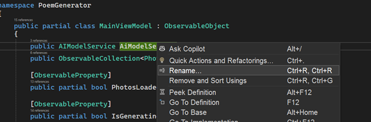
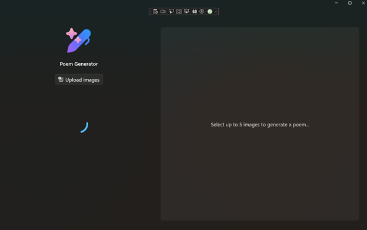

# Image Description 

The Image Description API in the Windows App SDK generates text descriptions for images using artificial intelligence.

> **_NOTE:_**  The Image Description API is not available in mainland China.

These APIs support the following types of text descriptions:

- **Accessibility**: This description provides a long, detailed explanation for users with accessibility needs.
- **Caption**: This description provides a short summary suitable as an image caption. This is the default type if no value is specified.
- **DetailedNarration**: This description provides a long, detailed explanation.
- **OfficeCharts**: This description provides a summary suitable for charts and diagrams.

Because these APIs use machine learning models, the generated text may sometimes not accurately describe the image. Do not use these APIs for images in these scenarios:

- These images contain potentially sensitive content where inaccurate descriptions could be controversial, such as flags, maps, globes, cultural symbols, or religious symbols.
- These images require highly accurate descriptions, such as those used for medical advice or diagnosis, legal content, or financial documents.

In this section, you update this AI model service to handle image description generation as part of the poem creation process. This update ensures that this app can process multiple images, generate accurate descriptions, and use these descriptions to craft creative and relevant poems.

You’ll update the AIModelService.cs to manage the Image Description portion of the poem generating.

1. In the Solutions Explorer, open `AIModelService.cs`
1. In the `InitializeModelsAsync`, under the LanguageModel checks, add the `ImageDescriptionGenerator`:

```c#
if (ImageDescriptionGenerator.GetReadyState() == AIFeatureReadyState.EnsureNeeded)
{
    var imageDescriptionDeploymentOperation = ImageDescriptionGenerator.EnsureReadyAsync();
}
Debug.WriteLine("Image model is available.");
```

1. In the `GeneratePoem`, replace `imageDescriptions` with:

```c#
// Process photos to generate descriptions
await ProcessPhotosForDescriptions(photos);

// Generate the prompt based on image descriptions
var imageDescriptions = string.Join(", ", photos.Select(photo => photo.Description));

```


<details>
  <summary>Updated GeneratePoem()</summary>
  
  ```c#
    public async Task<string> GeneratePoem(ObservableCollection<PhotoItem> photos, string poemType)
{
    // Process photos to generate descriptions
    await ProcessPhotosForDescriptions(photos);

    // Generate the prompt based on image descriptions
    var imageDescriptions = string.Join(", ", photos.Select(photo => photo.Description));
            
    var prompt = GeneratePrompt(imageDescriptions, poemType);

    // Generate the poem using the prompt
    return await GeneratePoemFromPrompt(prompt);
}
  ```
</details>

The `imageDescriptionGenerator` will be managed differently then `languageModel`, where the `imageDescriptionGenerator` will be reused because the app can process up to 5 images and instead of creating 5 Generators, it will create it once and reuse it.

1. Add property to AIModelService:

```c#
private ImageDescriptionGenerator? _imageDescriptionGenerator;
```

1. Add the `ProcessPhotosForDescriptions` & `DescribeImageAsync` functions:

```c#
private async Task ProcessPhotosForDescriptions(ObservableCollection<PhotoItem> photos){
    var photosToDescribe = photos.Where(photo => photo.Bitmap != null && photo.Description == null);

    await Parallel.ForEachAsync(photosToDescribe, async (photo, _) =>
    {
        var inputImage = ImageBuffer.CreateCopyFromBitmap(photo.Bitmap);
        photo.Description = await DescribeImageAsync(inputImage);
    });
}
public async Task<string> DescribeImageAsync(ImageBuffer inputImage)
 {
     // Ensure the generator is created only when needed
     if (_imageDescriptionGenerator == null)
     {
         _imageDescriptionGenerator = await ImageDescriptionGenerator.CreateAsync();
     }

     var filterOptions = new ContentFilterOptions
    {
        PromptMaxAllowedSeverityLevel = {Violent = SeverityLevel.High, Sexual = SeverityLevel.High, Hate = SeverityLevel.High, SelfHarm = SeverityLevel.High},
        ResponseMaxAllowedSeverityLevel = { Violent = SeverityLevel.High, Sexual = SeverityLevel.High, Hate = SeverityLevel.High, SelfHarm = SeverityLevel.High }
    };

     var response = await _imageDescriptionGenerator.DescribeAsync(inputImage, ImageDescriptionKind.DetailedDescrition, filterOptions);
     return response.Description;
 }

```

Because children’s art can be abstract, there is a chance that the Image Description might interpret images inappropriately, the `ContentFilterOptions` is used set the level of Severity which will block violent content. Here it is set to High. 

You can run the project:

1. On the title bar, Click on **Debug** > **Start Debugging** OR on your keyboard press **F5** key
1. Open the Output Window, View > Output or Ctrl+Alt+O
1. Locate the Debug messages for:

```
Initializing AI models...
Language model is available.
…
…
…
```

What happened to `"Image model is available."`?

Image-based text generation involves additional processing layers compared to text-only workflows, making the `ImageDescriptionGenerator` take a bit to be ready. 

The UI should reflect this, where images cannot be uploaded until the models are ready. You’ll add an overlay and a Progress Ring that will disappear once the models are ready. 

1. Open `MainPage.xaml` and scroll to the bottom
1. Between the last two `</Grid>` elements add:

```xml
<Grid x:Name="OverlayGrid"
    Background="Transparent"
    Visibility="{x:Bind AIModelService.IsModelLoading, Mode=OneWay}">
    <ProgressRing
        x:Name="ModelLoader"
        Width="64"
        Height="64"
        HorizontalAlignment="Center"
        VerticalAlignment="Center"
        IsActive="{x:Bind AIModelService.IsModelLoading, Mode=OneWay}" />
</Grid>

```

<details>
  <summary>Updated MainPage.xaml</summary>
  Starting from line 139 (the closing of the Poem’s `StackPanel`) to the EOF

  ```xml
            </StackPanel>
        </Grid>
        <Grid x:Name="OverlayGrid"
            Background="Transparent"
            Visibility="{x:Bind AIModelService.IsModelLoading, Mode=OneWay}">
            <ProgressRing
                x:Name="ModelLoader"
                Width="64"
                Height="64"
                HorizontalAlignment="Center"
                VerticalAlignment="Center"
                IsActive="{x:Bind AIModelService.IsModelLoading, Mode=OneWay}" />
        </Grid>
    </Grid>
</Page>
  ```
</details>

Here the Databinding is not to the `MainViewModel`, but to `AIModelService`. This could have been handled differently, but wanted to highlight that there are scenarios when you need to bind properties or methods that are specific to the view and are not part of the shared ViewModel. 

1. Open MainPage.xaml.cs

1. Update the `MainViewModel` property from `public MainViewModel ViewModel { get; } = new()` to:

```c#
public MainViewModel ViewModel { get; }

```

1. Under the `MainViewModel` property, add:

```c#
public AIModelService AIModelService { get; }
```

1. Update the MainPage constructor to initialize the `AIModelService`and pass it to the ViewModel:

```c#
public MainPage()
{
    InitializeComponent();
    AIModelService = new AIModelService();
    ViewModel = new MainViewModel(AIModelService);
}
```

1. Open `MainViewModel.cs`
1. Locate the `AIModelService` property
1. **Right click** or press **Ctrl+R** to rename it to: `_aiModelService`



1. Confirm that in the `GeneratePoem` function, that it changed from `GeneratedPoem = await AIModelService.GeneratePoem(Photos, SelectedPoemType);` to `GeneratedPoem = await _aiModelService.GeneratePoem(Photos, SelectedPoemType);`
1. Remove the `{ get; }` from the `_aiModelService`, it should look like:

```c#
public AIModelService _aiModelService;
```

1. Replace the `MainViewModel` constructor:

```c#
public MainViewModel(AIModelService aiModelService)
{
    _aiModelService = aiModelService;
    _ = _aiModelService.InitializeModelsAsync();
}
```

1. Open `AIModelService.cs`
1. Replace the class declaration line with:

```c#
public partial class AIModelService : ObservableObject
```

1. Add an ObservableProperty of IsModelLoading:

```c#
[ObservableProperty]
 public partial bool IsModelLoading { get; set; } = true;
```

1. Add to the end of the `InitializeModelsAsync`:

```c#
IsModelLoading = false;
```

You can run the project, but let's do it without internet:

1. On the Window's menu bar at the bottom of your screen, on the right side, **Click** on the **battery icon**
1. **Click** on the **Airplane mode**
1. On the title bar, **Click** on **Debug** > **Start Debugging** OR on your keyboard press **F5** key





1. Upload an image
1. Select a poem type
1. Click Generate

With these updates, this app now manages image descriptions by initializing and reusing a single instance of this `ImageDescriptionGenerator`. This approach avoids creating multiple generator instances when processing up to five images, which optimizes memory usage and improves performance. By implementing `ContentFilterOptions`, this service also filters out inappropriate content, maintaining a safe experience for users. The `IsModelLoading` property, exposed as an observable property, allows the UI to display a progress ring overlay until both the language and image models are fully initialized. This integration ensures that users cannot upload images until all AI models are ready, resulting in a responsive and reliable workflow for generating poems from images.

[Next Steps](./8-congrats.md)