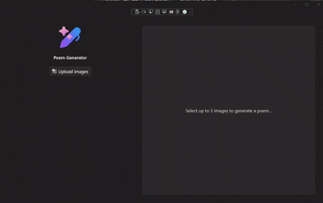

# WinUI & Local AI: PoemGenerator

This sample is intended as sample that showcase WinUI and Community Toolkit and language models running locally on Windows. This sample is the final app that is built in the [WinUI & Local AI lab](../1-instructions.md).



## Scenario

Jamie has a young child who enjoys hearing a different bedtime story every night. The child often returns home from daycare with new arts and crafts projects, inspiring Jamie to create a more personalized bedtime experience using those projects. Jamie wants an app that uses images of these arts and crafts to generate unique poems that she can their young child at bedtime.

At the same time, Jamie is concerned about privacy and wants to ensure that no images of her child or their creations are uploaded to online AI models or external services.

## App Description

The windows app  generates poems from images of children’s arts and crafts, while keeping all data and AI processing on the device for privacy.

The app uses the Windows App SDK and WinUI to provide a modern, intuitive, and accessible user experience. You will design the interface with XAML, use data binding to connect User Interface (UI) elements to data, and apply styles and controls to create an engaging application.

To generate poems, you will integrate Windows Copilot Runtime APIs. The app uses the Image Description API to create a detailed description of each arts and crafts image. This narration is then passed to the Phi Silica small language model, which generates unique poems—all running locally on-device for privacy and security.

## How to run

Recommend to complete [WinUi 101](https://learn.microsoft.com/training/modules/winui-101) lab.

1. Complete [Developer Setup](https://learn.microsoft.com/en-us/windows/apps/get-started/start-here)
2. Clone the repository

```powershell
git clone https://github.com/microsoft/Windows-DevRel.git
```

3. In Visual Studio, select `Open a project or solution`
4. Select `Windows-DevRel/Tutorials/winui-local-ai/PoemGenerator/PoemGenerator.sln`

Run the project:

5. On the title bar, **Click** on **Debug** > **Start Debugging** OR on your keyboard press **F5** key